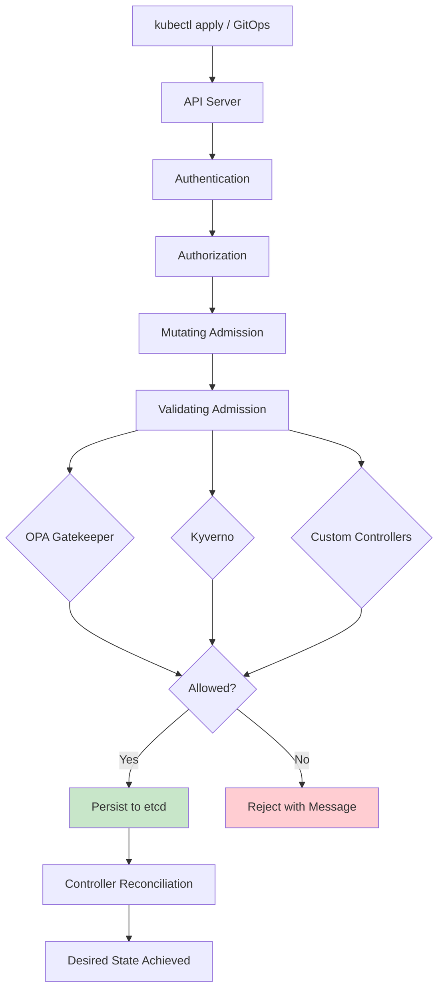
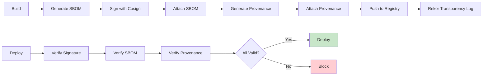
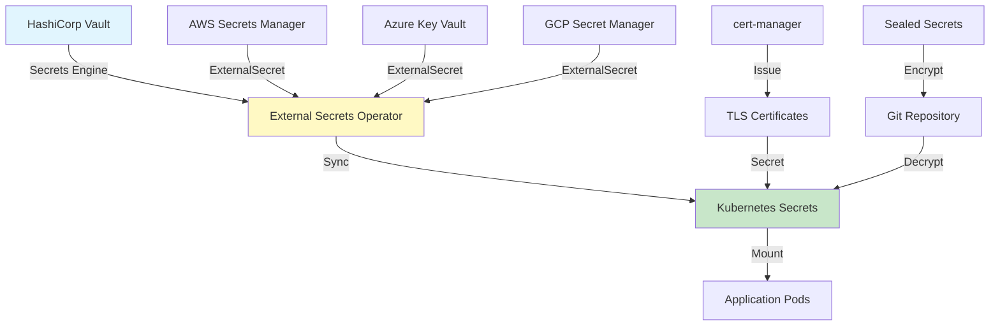
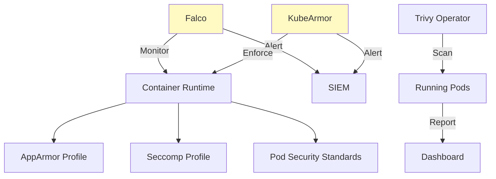
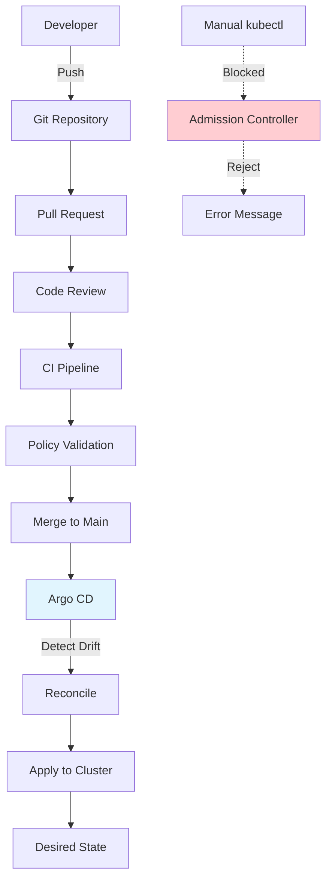
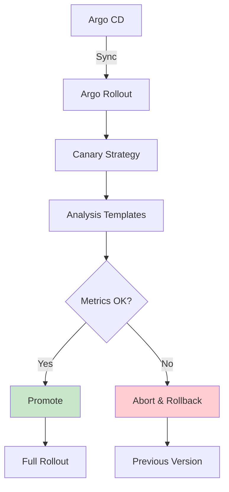
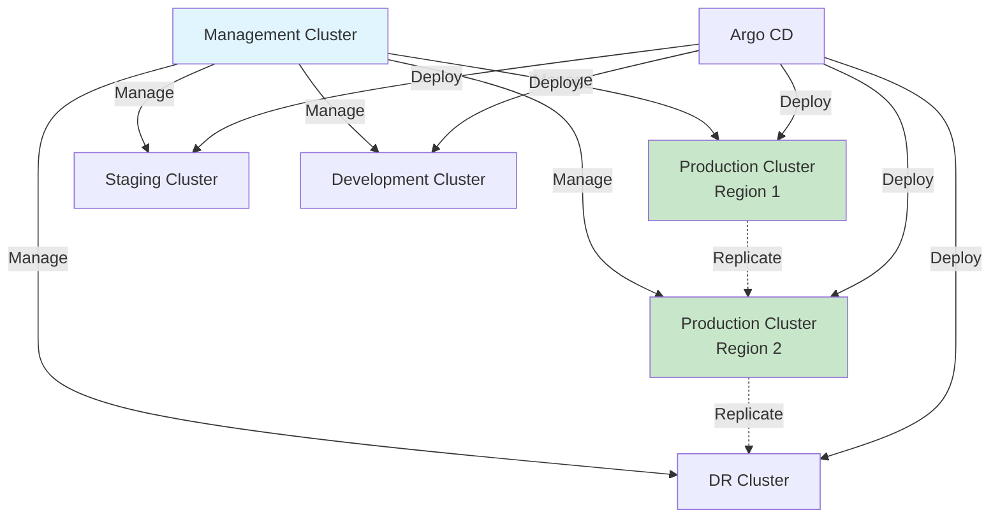

# 🚀 BuyTuk Educational Platform - Deployment Standards

**Version:** 1.0  
**Last Updated:** 2026-07-13  
**Status:** Final  
**Owner:** Platform Engineering + SRE Team  
**Next Review:** 2026-10-13

> **Scope:** Enterprise-grade deployment reference covering Kubernetes standards, CI/CD pipeline, progressive delivery, policy-as-code, supply chain security, runtime security, GitOps enforcement, and multi-cluster strategy.

---

## Table of Contents

| # | Section |
|---|---------|
| 1–18 | Deployment Philosophy, K8s Standards, Container Standards, Helm, Terraform, CI/CD Pipeline, Progressive Delivery (Canary/Blue-Green), Feature Flags, Secrets, Configuration, Service Mesh, Verification, Rollback, DR Deployment, Security Gates, Observability Integration, Supply Chain Security *(see DEPLOYMENT-PART1.md when available)* |
| 19 | [Policy as Code (OPA / Gatekeeper / Kyverno)](#19-policy-as-code) |
| 20 | [Supply Chain Security — Extended](#20-supply-chain-security-expanded) |
| 21 | [Secrets Management — Vault + ESO](#21-secrets-management-expanded) |
| 22 | [Runtime Security](#22-runtime-security) |
| 23 | [Compliance Mapping](#23-compliance-mapping) |
| 24 | [GitOps Enforcement](#24-gitops-enforcement) |
| 25 | [Progressive Delivery with Argo Rollouts](#25-progressive-delivery-with-argo-rollouts) |
| 26 | [Multi-Cluster Strategy](#26-multi-cluster-strategy) |
| A | [Deployment Runbooks](#appendix-a-deployment-runbooks) |
| B | [Deployment Checklist](#appendix-b-deployment-checklist) |
| C | [Deployment Metrics Dashboard](#appendix-c-deployment-metrics-dashboard) |

---

## Sections 1–18 Summary

| # | Topic | Key Decisions |
|---|-------|--------------|
| 1 | Deployment Philosophy | GitOps-first, immutable artifacts, progressive delivery mandatory |
| 2 | Deployment Architecture | Management cluster → per-env clusters; Argo CD as control plane |
| 3 | Kubernetes Standards | Namespace-per-service, NetworkPolicy default-deny, PodSecurityStandards Restricted |
| 4 | Container Standards | Non-root, read-only filesystem, resource limits required, no `:latest` |
| 5 | Helm Standards | Semantic versioning, values schema validation, tests in chart |
| 6 | Terraform Standards | Remote state (S3 + DynamoDB lock), modules per AWS service |
| 7 | CI/CD Pipeline | Lint → TypeCheck → Unit → Integration → Security → Build → Sign → Deploy |
| 8 | Progressive Delivery | Canary: 10 → 25 → 50 → 75 → 100%; Blue-Green for DB migrations |
| 9 | Feature Flags | LaunchDarkly / OpenFeature for decoupled feature releases |
| 10 | Secrets Management | External Secrets Operator + HashiCorp Vault; no secrets in Git |
| 11 | Configuration Management | ConfigMaps via GitOps; environment-specific values overlays |
| 12 | Service Mesh | Istio with mTLS mandatory between services |
| 13 | Deployment Verification | Synthetic checks, smoke tests, SLO gates before promotion |
| 14 | Rollback Strategy | Automated abort on analysis failure; Helm/Argo CD rollback procedures |
| 15 | Disaster Deployment | Cross-region failover via Argo CD ApplicationSet |
| 16 | Security Gates | SAST, DAST, container scan (Trivy), dependency scan (Snyk) all block on critical |
| 17 | Observability Integration | DORA metrics emitted per deployment; deployment markers in Grafana |
| 18 | Supply Chain Security | Cosign signing, SBOM (SPDX), SLSA provenance attached to every image |

---


## 19. Policy as Code

### 19.1 Admission Controllers Flow



### 19.2 OPA / Gatekeeper - Complete Policies

#### Policy 1: Required Labels

```yaml
# ConstraintTemplate
apiVersion: templates.gatekeeper.sh/v1
kind: ConstraintTemplate
metadata:
  name: k8srequiredlabels
  annotations:
    description: "Requires all resources to contain specified labels"
spec:
  crd:
    spec:
      names:
        kind: K8sRequiredLabels
      validation:
        openAPIV3Schema:
          type: object
          properties:
            labels:
              type: array
              items:
                type: string
            mandatoryLabels:
              type: array
              items:
                type: object
                properties:
                  key:
                    type: string
                  allowedRegex:
                    type: string
  targets:
    - target: admission.k8s.gatekeeper.sh
      rego: |
        package k8srequiredlabels
        
        violation[{"msg": msg}] {
          provided := {label | input.review.object.metadata.labels[label]}
          required := {label | label := input.parameters.labels[_]}
          missing := required - provided
          count(missing) > 0
          msg := sprintf("Resource missing required labels: %v", [missing])
        }
        
        violation[{"msg": msg}] {
          some mandatory
          mandatory := input.parameters.mandatoryLabels[_]
          value := input.review.object.metadata.labels[mandatory.key]
          not re_match(mandatory.allowedRegex, value)
          msg := sprintf("Label '%s' value '%s' does not match regex '%s'", 
                         [mandatory.key, value, mandatory.allowedRegex])
        }

---
# Constraint - Apply to all resources
apiVersion: constraints.gatekeeper.sh/v1beta1
kind: K8sRequiredLabels
metadata:
  name: all-must-have-buytuk-labels
spec:
  match:
    kinds:
      - apiGroups: ["", "apps", "batch"]
        kinds: ["Pod", "Deployment", "Service", "StatefulSet", "Job"]
  parameters:
    labels:
      - "app.kubernetes.io/name"
      - "app.kubernetes.io/version"
      - "app.kubernetes.io/managed-by"
      - "environment"
      - "team"
      - "domain"
      - "data-classification"
    mandatoryLabels:
      - key: "environment"
        allowedRegex: "^(dev|staging|uat|prod|dr)$"
      - key: "data-classification"
        allowedRegex: "^(public|internal|confidential|restricted)$"
      - key: "app.kubernetes.io/version"
        allowedRegex: "^v[0-9]+\\.[0-9]+\\.[0-9]+$"
```

#### Policy 2: Resource Limits Required

```yaml
apiVersion: templates.gatekeeper.sh/v1
kind: ConstraintTemplate
metadata:
  name: k8sresourcelimits
spec:
  crd:
    spec:
      names:
        kind: K8sResourceLimits
  targets:
    - target: admission.k8s.gatekeeper.sh
      rego: |
        package k8sresourcelimits
        
        violation[{"msg": msg}] {
          container := input.review.object.spec.containers[_]
          not container.resources.limits
          msg := sprintf("Container '%s' has no resource limits", [container.name])
        }
        
        violation[{"msg": msg}] {
          container := input.review.object.spec.containers[_]
          not container.resources.limits.cpu
          msg := sprintf("Container '%s' has no CPU limit", [container.name])
        }
        
        violation[{"msg": msg}] {
          container := input.review.object.spec.containers[_]
          not container.resources.limits.memory
          msg := sprintf("Container '%s' has no memory limit", [container.name])
        }
        
        violation[{"msg": msg}] {
          container := input.review.object.spec.containers[_]
          not container.resources.requests
          msg := sprintf("Container '%s' has no resource requests", [container.name])
        }

---
apiVersion: constraints.gatekeeper.sh/v1beta1
kind: K8sResourceLimits
metadata:
  name: container-must-have-limits
spec:
  match:
    kinds:
      - apiGroups: [""]
        kinds: ["Pod"]
      - apiGroups: ["apps"]
        kinds: ["Deployment", "StatefulSet", "DaemonSet"]
```

#### Policy 3: Image Registry Policy

```yaml
apiVersion: templates.gatekeeper.sh/v1
kind: ConstraintTemplate
metadata:
  name: k8simageregistry
spec:
  crd:
    spec:
      names:
        kind: K8sImageRegistry
      validation:
        openAPIV3Schema:
          type: object
          properties:
            allowedRegistries:
              type: array
              items:
                type: string
  targets:
    - target: admission.k8s.gatekeeper.sh
      rego: |
        package k8simageregistry
        
        violation[{"msg": msg}] {
          container := input.review.object.spec.containers[_]
          image := container.image
          not startswith(image, input.parameters.allowedRegistries[_])
          msg := sprintf("Container '%s' uses image from unapproved registry: %s", 
                         [container.name, image])
        }
        
        violation[{"msg": msg}] {
          container := input.review.object.spec.containers[_]
          endswith(container.image, ":latest")
          msg := sprintf("Container '%s' uses ':latest' tag which is forbidden", 
                         [container.name])
        }
        
        violation[{"msg": msg}] {
          container := input.review.object.spec.containers[_]
          not contains(container.image, "@sha256:")
          not re_match("^[a-zA-Z0-9_.-]+:[v]?[0-9]+\\.[0-9]+\\.[0-9]+", container.image)
          msg := sprintf("Container '%s' image must use semantic version or SHA256 digest", 
                         [container.name])
        }

---
apiVersion: constraints.gatekeeper.sh/v1beta1
kind: K8sImageRegistry
metadata:
  name: approved-registries-only
spec:
  match:
    kinds:
      - apiGroups: [""]
        kinds: ["Pod"]
  parameters:
    allowedRegistries:
      - "ghcr.io/buytuk/"
      - "public.ecr.aws/buytuk/"
      - "docker.io/library/"  # Only for official images
```

#### Policy 4: Prevent Privileged Containers

```yaml
apiVersion: templates.gatekeeper.sh/v1
kind: ConstraintTemplate
metadata:
  name: k8sblockprivileged
spec:
  crd:
    spec:
      names:
        kind: K8sBlockPrivileged
  targets:
    - target: admission.k8s.gatekeeper.sh
      rego: |
        package k8sblockprivileged
        
        violation[{"msg": msg}] {
          container := input.review.object.spec.containers[_]
          container.securityContext.privileged
          msg := sprintf("Container '%s' is privileged, which is forbidden", [container.name])
        }
        
        violation[{"msg": msg}] {
          container := input.review.object.spec.containers[_]
          container.securityContext.runAsUser == 0
          msg := sprintf("Container '%s' runs as root (UID 0)", [container.name])
        }
        
        violation[{"msg": msg}] {
          container := input.review.object.spec.containers[_]
          container.securityContext.allowPrivilegeEscalation
          msg := sprintf("Container '%s' allows privilege escalation", [container.name])
        }
        
        violation[{"msg": msg}] {
          container := input.review.object.spec.containers[_]
          volumeMount := container.volumeMounts[_]
          volume := input.review.object.spec.volumes[_]
          volume.hostPath
          volumeMount.name == volume.name
          msg := sprintf("Container '%s' mounts hostPath volume '%s'", 
                         [container.name, volumeMount.name])
        }

---
apiVersion: constraints.gatekeeper.sh/v1beta1
kind: K8sBlockPrivileged
metadata:
  name: block-privileged-containers
spec:
  match:
    kinds:
      - apiGroups: [""]
        kinds: ["Pod"]
```

#### Policy 5: Required Probes

```yaml
apiVersion: templates.gatekeeper.sh/v1
kind: ConstraintTemplate
metadata:
  name: k8srequiredprobes
spec:
  crd:
    spec:
      names:
        kind: K8sRequiredProbes
  targets:
    - target: admission.k8s.gatekeeper.sh
      rego: |
        package k8srequiredprobes
        
        violation[{"msg": msg}] {
          container := input.review.object.spec.containers[_]
          not container.livenessProbe
          msg := sprintf("Container '%s' missing livenessProbe", [container.name])
        }
        
        violation[{"msg": msg}] {
          container := input.review.object.spec.containers[_]
          not container.readinessProbe
          msg := sprintf("Container '%s' missing readinessProbe", [container.name])
        }
        
        violation[{"msg": msg}] {
          container := input.review.object.spec.containers[_]
          not container.startupProbe
          msg := sprintf("Container '%s' missing startupProbe", [container.name])
        }

---
apiVersion: constraints.gatekeeper.sh/v1beta1
kind: K8sRequiredProbes
metadata:
  name: containers-must-have-probes
spec:
  match:
    excludedNamespaces: ["kube-system", "cert-manager"]
    kinds:
      - apiGroups: ["apps"]
        kinds: ["Deployment", "StatefulSet"]
```

### 19.3 Kyverno Policies (Alternative)

```yaml
# Validate - Block latest tag
apiVersion: kyverno.io/v1
kind: ClusterPolicy
metadata:
  name: disallow-latest-tag
  annotations:
    policies.kyverno.io/title: Disallow Latest Tag
    policies.kyverno.io/category: Best Practices
    policies.kyverno.io/severity: high
spec:
  validationFailureAction: Enforce
  background: true
  rules:
    - name: require-image-tag
      match:
        any:
          - resources:
              kinds:
                - Pod
      validate:
        message: "Using ':latest' tag is not allowed. Use a specific version tag."
        pattern:
          spec:
            containers:
              - image: "!*:latest"
    
    - name: require-tag-not-latest
      match:
        any:
          - resources:
              kinds:
                - Pod
      validate:
        message: "Image must have a tag other than 'latest'."
        pattern:
          spec:
            containers:
              - image: "*:*"

---
# Mutate - Add default labels
apiVersion: kyverno.io/v1
kind: ClusterPolicy
metadata:
  name: add-default-labels
spec:
  rules:
    - name: add-team-label
      match:
        any:
          - resources:
              kinds:
                - Deployment
      mutate:
        patchStrategicMerge:
          metadata:
            labels:
              +(team): "{{request.namespace}}"

---
# Generate - Create NetworkPolicy for new namespace
apiVersion: kyverno.io/v1
kind: ClusterPolicy
metadata:
  name: generate-network-policy
spec:
  rules:
    - name: default-deny-ingress
      match:
        any:
          - resources:
              kinds:
                - Namespace
              selector:
                matchLabels:
                  buytuk.io/managed: "true"
      generate:
        apiVersion: networking.k8s.io/v1
        kind: NetworkPolicy
        name: default-deny-ingress
        namespace: "{{request.object.metadata.name}}"
        synchronize: true
        data:
          spec:
            podSelector: {}
            policyTypes:
              - Ingress
```

### 19.4 Policy Testing

```bash
# Test OPA policies locally
opa eval --data policy.rego --input request.json "data.k8srequiredlabels.violation"

# Test Kyverno policies
kyverno test ./policies/

# Test with kubeconform
kubeconform -summary -output json deployment.yaml

# Test with Datree
datree test deployment.yaml
```

---

## 20. Supply Chain Security (Expanded)

### 20.1 SLSA Compliance Levels

| Level       | Requirement             | Implementation                     |
| ----------- | ----------------------- | ---------------------------------- |
| **Level 0** | No guarantees           | N/A                                |
| **Level 1** | Provenance available    | Build metadata in CI/CD            |
| **Level 2** | Hosted build platform   | GitHub Actions (authenticated)     |
| **Level 3** | Hardened build platform | Signed builds, verified provenance |
| **Level 4** | Two-person review       | Required for production            |

**Target:** SLSA Level 3 for all production deployments

### 20.2 Sigstore Integration



### 20.3 Complete Signing Workflow

```yaml
# GitHub Actions - Complete signing workflow
- name: Install Cosign
  uses: sigstore/cosign-installer@v3.3.0

- name: Install Syft (SBOM generator)
  uses: anchore/sbom-action/download-syft@v0.15.0

- name: Build image
  id: build
  uses: docker/build-push-action@v5
  with:
    push: true
    tags: ${{ env.REGISTRY }}/${{ env.IMAGE_NAME }}:${{ github.sha }}

- name: Generate SBOM
  run: |
    syft packages registry:${{ env.REGISTRY }}/${{ env.IMAGE_NAME }}:${{ github.sha }} \
      -o spdx-json=sbom.spdx.json

- name: Sign image with keyless signing
  env:
    COSIGN_EXPERIMENTAL: 1
  run: |
    cosign sign --yes \
      ${{ env.REGISTRY }}/${{ env.IMAGE_NAME }}@${{ steps.build.outputs.digest }}

- name: Attach SBOM
  run: |
    cosign attach sbom \
      --sbom sbom.spdx.json \
      ${{ env.REGISTRY }}/${{ env.IMAGE_NAME }}@${{ steps.build.outputs.digest }}

- name: Generate provenance
  uses: actions/attest-build-provenance@v1
  with:
    subject-name: ${{ env.REGISTRY }}/${{ env.IMAGE_NAME }}
    subject-digest: ${{ steps.build.outputs.digest }}
    push-to-registry: true
```

### 20.4 Verification at Deploy Time

```yaml
# Argo CD pre-sync hook for verification
apiVersion: batch/v1
kind: Job
metadata:
  name: verify-image-${{ github.sha }}
  annotations:
    argocd.argoproj.io/hook: PreSync
spec:
  template:
    spec:
      containers:
        - name: verify
          image: ghcr.io/sigstore/cosign/cosign:v2.2.2
          command:
            - /bin/sh
            - -c
            - |
              # Verify signature
              cosign verify \
                --certificate-identity-regexp '.*' \
                --certificate-oidc-issuer-regexp '.*' \
                $IMAGE
              
              # Verify SBOM exists
              cosign verify-attestation \
                --type spdxjson \
                $IMAGE
              
              # Verify provenance
              cosign verify-attestation \
                --type slsaprovenance \
                --policy slsa-policy.cue \
                $IMAGE
          env:
            - name: IMAGE
              value: "$(IMAGE)"
      restartPolicy: Never
```

---

## 21. Secrets Management (Expanded)

### 21.1 Secrets Architecture



### 21.2 Vault Configuration

```hcl
# Vault policy for identity service
path "secret/data/prod/identity/*" {
  capabilities = ["read"]
}

path "secret/data/prod/identity/database" {
  capabilities = ["read"]
}

path "database/creds/identity-role" {
  capabilities = ["read"]
}

# Dynamic database credentials
path "database/creds/identity-role" {
  capabilities = ["read"]
}
```

### 21.3 External Secrets Operator

```yaml
# ClusterSecretStore - Vault backend
apiVersion: external-secrets.io/v1beta1
kind: ClusterSecretStore
metadata:
  name: vault-backend
spec:
  provider:
    vault:
      server: "https://vault.buytuk.com"
      path: "secret"
      version: "v2"
      auth:
        kubernetes:
          mountPath: "kubernetes"
          role: "identity-service-role"
          serviceAccountRef:
            name: "identity-service-sa"

---
# ExternalSecret - Sync from Vault
apiVersion: external-secrets.io/v1beta1
kind: ExternalSecret
metadata:
  name: identity-service-secrets
  namespace: buytuk-prod-identity
spec:
  refreshInterval: 1h
  secretStoreRef:
    name: vault-backend
    kind: ClusterSecretStore
  target:
    name: identity-service-secrets
    creationPolicy: Owner
    deletionPolicy: Delete
  data:
    - secretKey: database-password
      remoteRef:
        key: secret/data/prod/identity/database
        property: password
    - secretKey: api-key
      remoteRef:
        key: secret/data/prod/identity/api
        property: key
    - secretKey: jwt-secret
      remoteRef:
        key: secret/data/prod/identity/jwt
        property: secret
```

### 21.4 Dynamic Database Credentials

```yaml
# Vault database secrets engine
apiVersion: external-secrets.io/v1beta1
kind: ExternalSecret
metadata:
  name: identity-db-creds
spec:
  refreshInterval: 1h  # Rotate credentials hourly
  secretStoreRef:
    name: vault-backend
    kind: ClusterSecretStore
  target:
    name: identity-db-creds
  dataFrom:
    - extract:
        key: database/creds/identity-role
```

---

## 22. Runtime Security

### 22.1 Runtime Security Stack



### 22.2 AppArmor Profile

```yaml
# AppArmor profile for identity service
apiVersion: v1
kind: ConfigMap
metadata:
  name: identity-apparmor
  namespace: buytuk-prod-identity
data:
  identity-service: |
    #include <tunables/global>
    
    profile identity-service flags=(attach_disconnected,mediate_deleted) {
      #include <abstractions/base>
      
      # Network access
      network inet stream,
      network inet6 stream,
      
      # Deny everything else
      deny @{PROC}/* w,
      deny @{PROC}/sys/kernel/{?,??,[^s][^h][^m]**} w,
      deny @{PROC}/sysrq-trigger rwklx,
      deny @{PROC}/kmsg rwklx,
      deny @{PROC}/sys/kernel/[!s][!h][!m]* w,
      deny @{PROC}/sys/kernel/??** w,
      deny @{PROC}/sys/kernel/shm* w,
      
      deny mount,
      
      deny /sys/[^f]*/** wklx,
      deny /sys/f[^s]*/** wklx,
      deny /sys/fs/[^c]*/** wklx,
      deny /sys/fs/c[^g]*/** wklx,
      deny /sys/fs/cg[^r]*/** wklx,
      deny /sys/firmware/** rwklx,
      deny /sys/devices/virtual/powercap/** rwklx,
      deny /sys/kernel/security/** rwklx,
    }

---
# Deployment with AppArmor
apiVersion: apps/v1
kind: Deployment
metadata:
  name: identity-service
spec:
  template:
    metadata:
      annotations:
        container.apparmor.security.beta.kubernetes.io/identity-service: localhost/identity-service
```

### 22.3 Seccomp Profile

```json
{
  "defaultAction": "SCMP_ACT_ERRNO",
  "defaultErrnoRet": 1,
  "architectures": ["SCMP_ARCH_X86_64", "SCMP_ARCH_AARCH64"],
  "syscalls": [
    {
      "names": [
        "accept4", "access", "bind", "brk", "capget", "capset",
        "clone", "close", "connect", "dup2", "epoll_create1",
        "epoll_ctl", "epoll_wait", "exit", "exit_group", "faccessat",
        "fstat", "futex", "getpid", "getsockname", "getsockopt",
        "listen", "mmap", "mprotect", "munmap", "nanosleep",
        "newfstatat", "openat", "pipe2", "poll", "prctl",
        "pread64", "read", "recvfrom", "recvmsg", "rt_sigaction",
        "rt_sigprocmask", "rt_sigreturn", "sched_getaffinity",
        "sendmsg", "sendto", "set_robust_list", "set_tid_address",
        "setsockopt", "shutdown", "sigaltstack", "socket",
        "tgkill", "write"
      ],
      "action": "SCMP_ACT_ALLOW"
    }
  ]
}
```

```yaml
# Apply seccomp profile
apiVersion: apps/v1
kind: Deployment
metadata:
  name: identity-service
spec:
  template:
    spec:
      securityContext:
        seccompProfile:
          type: Localhost
          localhostProfile: profiles/identity-service.json
```

### 22.4 Falco Rules

```yaml
# Falco custom rules for BuyTuk
- rule: Unauthorized Process in Container
  desc: Detect unauthorized process execution in container
  condition: >
    spawned_process and container and
    not proc.name in (allowed_processes)
  output: >
    Unauthorized process executed in container
    (user=%user.name container=%container.name
    process=%proc.name parent=%proc.pname
    command=%proc.cmdline)
  priority: WARNING
  tags: [container, process]

- rule: Shell Spawned in Container
  desc: Detect shell spawned in container
  condition: >
    spawned_process and container and
    proc.name in (bash, sh, zsh, dash)
  output: >
    Shell spawned in container
    (user=%user.name container=%container.name
    shell=%proc.name parent=%proc.pname)
  priority: CRITICAL
  tags: [container, shell, mitre_execution]

- rule: Outbound Connection to Suspicious Destination
  desc: Detect outbound connection to suspicious destination
  condition: >
    evt.type=connect and evt.dir=< and
    fd.typechar=4 and
    fd.sip != 10.0.0.0/8 and
    fd.sip != 172.16.0.0/12 and
    fd.sip != 192.168.0.0/16
  output: >
    Outbound connection to external IP
    (user=%user.name container=%container.name
    connection=%fd.name)
  priority: WARNING
  tags: [network, mitre_command_and_control]

- rule: PII Access Detected
  desc: Detect access to PII fields
  condition: >
    evt.type=read and container and
    (evt.buffer contains "national_id" or
     evt.buffer contains "passport" or
     evt.buffer contains "credit_card")
  output: >
    PII field accessed in container
    (user=%user.name container=%container.name)
  priority: CRITICAL
  tags: [pii, compliance, gdpr]
```

---

## 23. Compliance Mapping

### 23.1 Compliance Frameworks

| Framework                    | Scope                | Controls      | Audit Frequency |
| ---------------------------- | -------------------- | ------------- | --------------- |
| **CIS Kubernetes Benchmark** | Cluster hardening    | 100+ controls | Quarterly       |
| **NSA Kubernetes Hardening** | Security hardening   | 50+ controls  | Quarterly       |
| **NIST SP 800-190**          | Container security   | 80+ controls  | Annually        |
| **ISO 27001**                | Information security | 114 controls  | Annually        |
| **SOC 2 Type II**            | Service controls     | 60+ controls  | Annually        |
| **GDPR**                     | Data protection      | 99 articles   | Continuous      |
| **FERPA**                    | Educational records  | 15 sections   | Annually        |

### 23.2 CIS Benchmark Automation

```yaml
# kube-bench scan
apiVersion: batch/v1
kind: CronJob
metadata:
  name: kube-bench-scan
  namespace: security
spec:
  schedule: "0 2 * * 0"  # Weekly on Sunday at 2 AM
  jobTemplate:
    spec:
      template:
        spec:
          containers:
            - name: kube-bench
              image: aquasec/kube-bench:latest
              command: ["kube-bench", "--json"]
              volumeMounts:
                - name: var-lib-kubelet
                  mountPath: /var/lib/kubelet
                - name: etc-systemd
                  mountPath: /etc/systemd
                - name: etc-kubernetes
                  mountPath: /etc/kubernetes
          volumes:
            - name: var-lib-kubelet
              hostPath:
                path: /var/lib/kubelet
            - name: etc-systemd
              hostPath:
                path: /etc/systemd
            - name: etc-kubernetes
              hostPath:
                path: /etc/kubernetes
          restartPolicy: OnFailure
```

### 23.3 Compliance Dashboard

```typescript
const complianceMetrics = {
  // CIS Benchmark
  'cis_benchmark_score': Gauge,              // Overall score
  'cis_benchmark_failures_total': Counter,   // Failed controls
  'cis_benchmark_warnings_total': Counter,
  
  // Framework-specific
  'gdpr_compliance_score': Gauge,
  'ferpa_compliance_score': Gauge,
  'soc2_compliance_score': Gauge,
  
  // Violations
  'compliance_violations_total': Counter,    // Labels: framework
  'compliance_violations_by_severity': Counter,
  
  // Audit
  'last_audit_timestamp': Gauge,
  'audit_findings_total': Gauge
};
```

---

## 24. GitOps Enforcement

### 24.1 GitOps Architecture



### 24.2 Argo CD Configuration

```yaml
# Argo CD Application
apiVersion: argoproj.io/v1alpha1
kind: Application
metadata:
  name: identity-service-prod
  namespace: argocd
  finalizers:
    - resources-finalizer.argocd.argoproj.io
spec:
  project: buytuk-prod
  
  source:
    repoURL: https://github.com/buytuk/infrastructure.git
    targetRevision: main
    path: environments/prod/identity-service
    
  destination:
    server: https://kubernetes.default.svc
    namespace: buytuk-prod-identity
  
  syncPolicy:
    automated:
      prune: true
      selfHeal: true
      allowEmpty: false
    syncOptions:
      - CreateNamespace=true
      - PrunePropagationPolicy=foreground
      - PruneLast=true
      - ApplyOutOfSyncOnly=true
    retry:
      limit: 5
      backoff:
        duration: 5s
        factor: 2
        maxDuration: 3m
  
  revisionHistoryLimit: 10
  
  ignoreDifferences:
    - group: apps
      kind: Deployment
      jsonPointers:
        - /spec/replicas
```

### 24.3 Prevent Manual Changes

```yaml
# Block manual kubectl apply
apiVersion: kyverno.io/v1
kind: ClusterPolicy
metadata:
  name: block-manual-changes
spec:
  validationFailureAction: Enforce
  rules:
    - name: require-argocd-label
      match:
        any:
          - resources:
              kinds:
                - Deployment
                - Service
                - ConfigMap
      validate:
        message: "Manual changes are not allowed. Use GitOps (Argo CD) for all deployments."
        pattern:
          metadata:
            labels:
              argocd.argoproj.io/instance: "*?"
```

---

## 25. Progressive Delivery with Argo Rollouts

### 25.1 Argo Rollouts Architecture



### 25.2 Rollout Configuration

```yaml
apiVersion: argoproj.io/v1alpha1
kind: Rollout
metadata:
  name: identity-service
spec:
  replicas: 10
  
  strategy:
    canary:
      steps:
        - setWeight: 10
        - pause: {duration: 5m}
        - setWeight: 25
        - pause: {duration: 5m}
        - setWeight: 50
        - pause: {duration: 10m}
        - setWeight: 75
        - pause: {duration: 10m}
        - setWeight: 100
      
      analysis:
        templates:
          - templateName: success-rate
        startingStep: 2
        args:
          - name: service-name
            value: identity-service
      
      canaryService: identity-service-canary
      stableService: identity-service-stable
      trafficRouting:
        istio:
          virtualServices:
            - name: identity-service
              routes:
                - primary

---
# Analysis Template
apiVersion: argoproj.io/v1alpha1
kind: AnalysisTemplate
metadata:
  name: success-rate
spec:
  args:
    - name: service-name
    - name: promotion-label
  metrics:
    - name: success-rate
      interval: 1m
      successCondition: result[0] >= 0.99
      failureLimit: 3
      provider:
        prometheus:
          address: http://prometheus:9090
          query: |
            sum(irate(
              istio_requests_total{
                reporter=source,
                destination_service_name=~{{args.service-name}},
                response_code!~5.*
              }[5m]
            ))
            /
            sum(irate(
              istio_requests_total{
                reporter=source,
                destination_service_name=~{{args.service-name}}
              }[5m]
            ))
    
    - name: latency-p95
      interval: 1m
      successCondition: result[0] <= 0.5
      failureLimit: 3
      provider:
        prometheus:
          address: http://prometheus:9090
          query: |
            histogram_quantile(0.95,
              sum(irate(
                istio_request_duration_milliseconds_bucket{
                  reporter=source,
                  destination_service_name=~{{args.service-name}}
                }[5m]
              )) by (le)
            ) / 1000
    
    - name: error-budget-remaining
      interval: 5m
      successCondition: result[0] >= 0.5
      failureLimit: 2
      provider:
        prometheus:
          address: http://prometheus:9090
          query: |
            1 - (
              sum(rate(http_requests_total{
                service={{args.service-name}},
                status_code=~"5.."
              }[30d]))
              /
              sum(rate(http_requests_total{
                service={{args.service-name}}
              }[30d]))
            )
```

---

## 26. Multi-Cluster Strategy

### 26.1 Cluster Topology



### 26.2 Cluster Registration

```yaml
# Register cluster with Argo CD
apiVersion: v1
kind: Secret
metadata:
  name: prod-cluster-region-2
  namespace: argocd
  labels:
    argocd.argoproj.io/secret-type: cluster
type: Opaque
stringData:
  name: prod-region-2
  server: https://kubernetes.prod-region-2.buytuk.com
  config: |
    {
      "bearerToken": "***",
      "tlsClientConfig": {
        "insecure": false,
        "caData": "***"
      }
    }
```

### 26.3 Multi-Cluster Application

```yaml
# ApplicationSet for multi-cluster deployment
apiVersion: argoproj.io/v1alpha1
kind: ApplicationSet
metadata:
  name: identity-service
  namespace: argocd
spec:
  generators:
    - clusters:
        selector:
          matchLabels:
            environment: production
  template:
    metadata:
      name: 'identity-service-{{name}}'
    spec:
      project: buytuk-prod
      source:
        repoURL: https://github.com/buytuk/infrastructure.git
        targetRevision: main
        path: environments/prod/identity-service
      destination:
        server: '{{server}}'
        namespace: buytuk-prod-identity
      syncPolicy:
        automated:
          prune: true
          selfHeal: true
```

---

## Appendix A: Deployment Runbooks

### A.1 Rollback Runbook

````markdown
# Runbook: Production Rollback

## Severity: P1 - Critical

## Triggers
- Canary analysis fails
- Error budget burn rate > 14.4x
- Success rate < 99%
- Latency p95 > 500ms

## Immediate Actions

### 1. Verify Issue
```bash
# Check deployment status
kubectl get rollout identity-service -n buytuk-prod-identity

# Check Argo Rollouts
kubectl argo rollouts get rollout identity-service -n buytuk-prod-identity

# Check metrics
kubectl port-forward svc/prometheus 9090 -n monitoring
````

### 2. Execute Rollback

```bash
# Argo Rollouts abort
kubectl argo rollouts abort identity-service -n buytuk-prod-identity

# Or Helm rollback
helm rollback identity-service 1 -n buytuk-prod-identity

# Or Argo CD rollback
argocd app rollback identity-service-prod 1
```

### 3. Verify Rollback

```bash
# Check pods
kubectl get pods -n buytuk-prod-identity

# Check health
curl https://identity.buytuk.com/health/ready

# Check metrics
kubectl port-forward svc/grafana 3000 -n monitoring
```

### 4. Communicate

* Notify on-call team
* Update incident status
* Notify stakeholders
* Post to status page

### 5. Post-Mortem

* Root cause analysis
* Timeline documentation
* Preventive measures
* Update runbook

````

### A.2 Database Migration Rollback

```markdown
# Runbook: Database Migration Rollback

## Severity: P1 - Critical

## Prerequisites
- Backup taken before migration
- Rollback script prepared
- Maintenance window approved

## Steps

### 1. Stop Application
```bash
kubectl scale deployment/identity-service --replicas=0 -n buytuk-prod-identity
````

### 2. Backup Current State

```bash
pg_dump -h prod-db -U identity identity_prod > backup_before_rollback.sql
```

### 3. Execute Rollback

```bash
psql -h prod-db -U identity identity_prod -f migrations/rollback_20260713.sql
```

### 4. Verify

```bash
psql -h prod-db -U identity identity_prod -c "SELECT * FROM schema_migrations ORDER BY version DESC LIMIT 5;"
```

### 5. Restart Application

```bash
kubectl scale deployment/identity-service --replicas=3 -n buytuk-prod-identity
```

### 6. Verify Health

```bash
curl https://identity.buytuk.com/health/ready
```

````

---

## Appendix B: Deployment Checklist

### B.1 Pre-Deployment

- [ ] Code review approved
- [ ] All tests passing
- [ ] Security scans clean
- [ ] Database migration tested
- [ ] Rollback plan documented
- [ ] Feature flags configured
- [ ] Monitoring configured
- [ ] Alerts configured
- [ ] Runbook updated
- [ ] Stakeholders notified

### B.2 During Deployment

- [ ] Canary analysis running
- [ ] Metrics within thresholds
- [ ] Error budget healthy
- [ ] Logs clean
- [ ] Traces normal
- [ ] No alerts firing

### B.3 Post-Deployment

- [ ] Smoke tests passing
- [ ] Synthetic monitoring healthy
- [ ] Performance within SLA
- [ ] Feature flags verified
- [ ] Documentation updated
- [ ] Stakeholders notified
- [ ] Incident window closed

---

## Appendix C: Deployment Metrics Dashboard

### C.1 Key Metrics

```typescript
const deploymentDashboard = {
  // Frequency
  'deployment_frequency_per_day': Gauge,
  'deployment_frequency_per_week': Gauge,
  
  // Lead time
  'lead_time_for_changes_hours': Histogram,
  
  // MTTR
  'mttr_minutes': Histogram,
  
  // Change failure rate
  'change_failure_rate_percent': Gauge,
  
  // Success rate
  'deployment_success_rate_percent': Gauge,
  
  // Rollback
  'rollback_rate_percent': Gauge,
  'rollback_time_minutes': Histogram,
  
  // Pipeline
  'pipeline_duration_minutes': Histogram,
  'pipeline_success_rate_percent': Gauge,
  
  // DORA metrics
  'dora_elite_status': Gauge  // 1 if all 4 metrics met
};
````

### C.2 DORA Metrics Targets

| Metric                   | Elite     | High         | Medium   | Low       |
| ------------------------ | --------- | ------------ | -------- | --------- |
| **Deployment Frequency** | On-demand | Daily-Weekly | Monthly  | < Monthly |
| **Lead Time**            | < 1 hour  | < 1 day      | < 1 week | > 1 week  |
| **MTTR**                 | < 1 hour  | < 1 day      | < 1 week | > 1 week  |
| **Change Failure Rate**  | < 5%      | < 10%        | < 15%    | > 15%     |

**BuyTuk Target:** Elite level for all metrics

---

**End of Deployment Architecture**

**Document Version:** 1.0
**Next Review:** 2026-10-13
**Owner:** Platform Engineering + SRE Team

```

---
